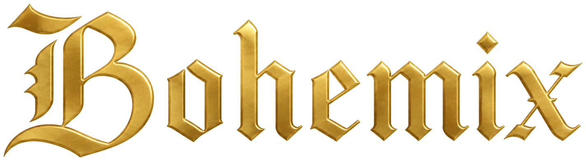

<div align="center">
  

  <p><strong>为《天国：拯救 II》玩家打造游戏启动器兼模组管理器</strong></p>
  <p>启动游戏、管理 Mod、保护存档、追踪进度，并在一个安静可靠的工作台中探索炼金与锻造。</p>

  [](https://github.com/Luming-Sky/BohemiX/actions/workflows/ci.yml)
  
  
  [](LICENSE)
</div>

[中文](#中文) | [English](#english)

# AI 辅助开发

BohemiX 的部分开发工作借助了基于 AI 的工具。所有由 AI 生成或建议的代码及文档均由项目作者进行审查、测试和维护。最终软件、许可协议及版本发布的相关责任均由项目作者承担。

# 产品定位

BohemiX 面向喜欢在《天国：拯救 II》里配置模组、体验游戏玩法的玩家。它提供从游戏下载验证、模组管理与下载、存档管理到游戏玩法模拟综合体验。极大地降低玩家配置模组、游玩游戏的门槛。

# 核心功能

| 模块 | 能力 |
| --- | --- |
| 游戏启动器 | 扫描 Steam 与本地目录，识别 `KingdomCome.exe`，保存已验证安装位置，对于异常退出提供诊断。 |
| Mod 管理 | 扫描本地 Mod、自动分析健康状态与文件冲突、一键修复模组加载顺序，支持导入外部整合包、手动分组等功能。 |
| Mod 获取与安装 | 支持从本地压缩包、Nexus Mods、Nexus Collections 与 Steam Workshop 下载模组和整合包资源，提供模组简介翻译、下载队列、合集目录、依赖选择和事务安装。 |
| 存档系统 | 管理玩家存档配置与槽位，监控 `.whs` 变化，创建单文件保护节点或完整快照，并支持导入、导出、保留策略和恢复前验证。 |
| 玩家档案 | 管理多个本地玩家档案。 |
| Lab 功能 | 内置炼金与锻造模拟模块，通过高规格模拟原版游戏玩法重现 KCD2 的工艺流程。 |
| 设置与诊断 | 支持简体中文和 English、外观与运行参数、日志导航、全局异常报告、更新检查和依赖状态查看。

# 安装与运行

### 使用发布包

1. 从 [GitHub Releases](https://github.com/Luming-Sky/BohemiX/releases) 获取 Windows x64 ZIP 和 SHA-256 校验文件。
2. 校验压缩包，完整解压到可写目录，不要直接在 ZIP 内运行程序。
3. 运行 `BohemiX.App.exe`。
4. 首次启动时让 BohemiX 自动扫描游戏，或手动选择 `KingdomCome.exe`。

发布包为 .NET 8 自包含版本，通常不需要单独安装 .NET Runtime。Nexus 浏览器授权依赖 Microsoft Edge WebView2 Runtime；当前 Windows 10/11 通常已经包含它。

### 系统要求

- Windows 10 或 Windows 11，x64
- 《天国：拯救 II》的合法本地安装
- 足够容纳 Mod、存档快照与下载缓存的磁盘空间
- 使用 Nexus 浏览器授权时需要 Edge WebView2 Runtime

## 隐私与安全

- BohemiX 默认离线可用；只有下载、账户授权、更新检查等明确的在线功能会访问网络。
- Nexus 登录发生在独立的 WebView2 会话中，密码只提交给 Nexus Mods 页面。Cookie 仅附加到经过验证的 `nexusmods.com` 主机，个人 API Key 使用 Windows Data Protection 加密。
- 日志不会记录 Nexus Cookie、API Key 等敏感值。
- 远程 Mod 合集目录必须通过 ECDSA P-256/SHA-256 签名验证；验证失败时回退到上次可信缓存或内置目录。
- 原生 usvfs 文件固定版本并校验 SHA-256，发布脚本在依赖缺失、架构错误或哈希不符时直接失败。

# 更多说明：

- [Nexus 账户绑定](docs/NexusAccountBinding.md)
- [Nexus Cookie 安全审计](docs/NexusCookieAuthSecurityAudit.md)
- [存档快照架构](docs/SnapshotStorageArchitecture.md)
- [发布检查清单](docs/ReleaseChecklist.md)

# 从源码构建

需要 Git、PowerShell 和 [.NET 8 SDK](https://dotnet.microsoft.com/download/dotnet/8.0)。

```powershell
git clone https://github.com/Luming-Sky/BohemiX.git
cd BohemiX
dotnet restore BohemiX.sln
dotnet test BohemiX.sln -c Release --nologo
dotnet run --project src/BohemiX.App/BohemiX.App.csproj -c Release
```

生成经过测试和依赖校验的 Windows x64 便携包：

```powershell
.\tools\publish-win-x64.ps1 -Version "0.9.0"
```

脚本会运行完整 Release 测试、发布自包含程序、裁剪无关运行时、校验原生依赖、复制许可证，并生成 ZIP 与 `SHA256SUMS.txt`。

## 技术架构

```text
BohemiX.App                    Avalonia 桌面外壳、视图与应用组合
  |-- BohemiX.Modules.Alchemy 炼金模块
  |-- BohemiX.Modules.Forge   锻造模块
  |-- BohemiX.Modules.SaveManager 存档模块
  |-- BohemiX.Infrastructure  SQLite、文件系统、进程、网络与 usvfs 实现
  `-- BohemiX.Core            领域模型、服务契约与纯业务规则
```

项目使用 .NET 8、Avalonia 11、CommunityToolkit.Mvvm、SQLite/Dapper、Serilog、SkiaSharp、Silk.NET/OpenGL、WebView2、LibVLCSharp 和 usvfs。依赖方向与运行时生命周期说明见 [架构文档](docs/Architecture.md)。

## 主要目录：

```text
src/          应用、核心、基础设施与功能模块
tests/        Core、App、Alchemy 与 Forge 自动化测试
tools/        发布、资源生成和目录校验工具
workers/      Echo Cave Cloudflare Worker
third-party/  固定版本的原生依赖及完整许可证
docs/         产品、架构、安全与发布文档
```

## 许可证与声明

BohemiX 项目源码采用 [MIT License](LICENSE)。随发布包分发的 usvfs 及其他第三方组件受各自许可证约束，详情见 [THIRD-PARTY-NOTICES.md](THIRD-PARTY-NOTICES.md) 和发布包中的 `native` 目录。

BohemiX 是社区开发的第三方工具，与 Warhorse Studios、Deep Silver、Nexus Mods、Valve 或 Epic Games 无隶属或背书关系。《天国：拯救》及相关名称、图像和商标归其各自权利人所有。


\---
# English

# AI-Assisted Development

Parts of BohemiX were developed with the assistance of AI-based tools. All generated or suggested code and documentation are reviewed, tested, and maintained by the project author. Responsibility for the final software, licensing, and releases remains with the project author.

# Product Positioning

BohemiX is designed for players who enjoy configuring mods and exploring new ways to play Kingdom Come: Deliverance II. It provides an integrated experience covering game installation verification, mod management and downloads, save management, and gameplay simulations. Its goal is to make configuring mods and getting into the game significantly easier.

# Core Features

| Module | Capabilities |
| --- | --- |
| Game launcher | Scans Steam and local directories, detects `KingdomCome.exe`, saves verified installation paths, and provides diagnostics for abnormal exits. |
| Mod management | Scans local mods, automatically analyses health and file conflicts, repairs mod load order with one click, and supports external mod pack imports and manual grouping. |
| Mod acquisition and installation | Downloads mods and mod pack resources from local archives, Nexus Mods, Nexus Collections, and Steam Workshop. Includes translated mod descriptions, download queues, collection catalogues, prerequisite selection, and rollback-protected installation. |
| Save system | Manages player save configurations and slots, monitors `.whs` changes, creates individual protection points or complete snapshots, and supports import, export, retention policies, and pre-restore validation. |
| Player profiles | Manages multiple local player profiles. |
| Lab | Includes alchemy and forging simulation modules that recreate KCD2 crafting workflows with high-fidelity simulations of the original gameplay. |
| Settings and diagnostics | Supports Simplified Chinese and English, appearance and runtime options, log navigation, global error reports, update checks, and dependency status. |

# Installation and Use

### Using a Release Package

1. Download the Windows x64 ZIP and SHA-256 checksum file from [GitHub Releases](https://github.com/Luming-Sky/BohemiX/releases).
2. Verify the archive and extract it completely to a writable directory. Do not run the application from inside the ZIP file.
3. Run `BohemiX.App.exe`.
4. On first launch, let BohemiX scan for the game automatically or select `KingdomCome.exe` manually.

The release package is a self-contained .NET 8 build and normally does not require a separate .NET Runtime installation. Nexus browser authentication requires Microsoft Edge WebView2 Runtime, which is already included with most current Windows 10 and Windows 11 installations.

### System Requirements

- Windows 10 or Windows 11, x64
- A legitimate local installation of Kingdom Come: Deliverance II
- Enough disk space for mods, save snapshots, and download caches
- Microsoft Edge WebView2 Runtime for Nexus browser authentication

## Privacy and Security

- BohemiX works offline by default. Network access is limited to explicit online features such as downloads, account authorization, and update checks.
- Nexus authentication takes place in a separate WebView2 session. Passwords are submitted only to Nexus Mods pages. Cookies are attached only to verified `nexusmods.com` hosts, and personal API keys are encrypted with Windows Data Protection.
- Logs do not record sensitive values such as Nexus cookies, API keys.
- Remote mod collection catalogues must pass ECDSA P-256/SHA-256 signature verification. If verification fails, BohemiX falls back to the most recent trusted cache or the built-in catalogue.
- Native usvfs files use pinned versions and SHA-256 validation. The release script fails when a dependency is missing, has the wrong architecture, or does not match the expected hash.

# Further Documentation

- [Nexus account binding](docs/NexusAccountBinding.md)
- [Nexus cookie security audit](docs/NexusCookieAuthSecurityAudit.md)
- [Save snapshot architecture](docs/SnapshotStorageArchitecture.md)
- [Release checklist](docs/ReleaseChecklist.md)

# Building from Source

Git, PowerShell, and the [.NET 8 SDK](https://dotnet.microsoft.com/download/dotnet/8.0) are required.

```powershell
git clone https://github.com/Luming-Sky/BohemiX.git
cd BohemiX
dotnet restore BohemiX.sln
dotnet test BohemiX.sln -c Release --nologo
dotnet run --project src/BohemiX.App/BohemiX.App.csproj -c Release
```

To generate a tested and dependency-validated portable Windows x64 package:

```powershell
.\tools\publish-win-x64.ps1 -Version "0.9.0"
```

The script runs the complete Release test suite, publishes a self-contained application, removes unrelated runtime files, validates native dependencies, copies licenses, and generates a ZIP archive and `SHA256SUMS.txt`.

## Architecture

```text
BohemiX.App                         Avalonia desktop shell, views, and application composition
  |-- BohemiX.Modules.Alchemy      Alchemy module
  |-- BohemiX.Modules.Forge        Forging module
  |-- BohemiX.Modules.SaveManager  Save management module
  |-- BohemiX.Infrastructure       SQLite, file system, process, network, and usvfs implementations
  `-- BohemiX.Core                 Domain models, service contracts, and business rules
```

The project uses .NET 8, Avalonia 11, CommunityToolkit.Mvvm, SQLite/Dapper, Serilog, SkiaSharp, Silk.NET/OpenGL, WebView2, LibVLCSharp, and usvfs. See the [architecture documentation](docs/Architecture.md) for dependency rules and runtime lifecycle details.

## Main Directories

```text
src/          Application, core, infrastructure, and feature modules
tests/        Core, App, Alchemy, and Forge automated tests
tools/        Publishing, asset generation, and catalogue validation tools
workers/      Echo Cave Cloudflare Worker
third-party/  Pinned native dependencies and complete license files
docs/         Product, architecture, security, and release documentation
```

## License and Disclaimer

BohemiX source code is distributed under the [MIT License](LICENSE). usvfs and other third-party components included in release packages remain subject to their respective licenses. See [THIRD-PARTY-NOTICES.md](THIRD-PARTY-NOTICES.md) and the release package's `native` directory for details.

BohemiX is an independent community project. It is not affiliated with or endorsed by Warhorse Studios, Deep Silver, Nexus Mods, Valve, or Epic Games. Kingdom Come: Deliverance and all related names, images, and trademarks belong to their respective owners.

